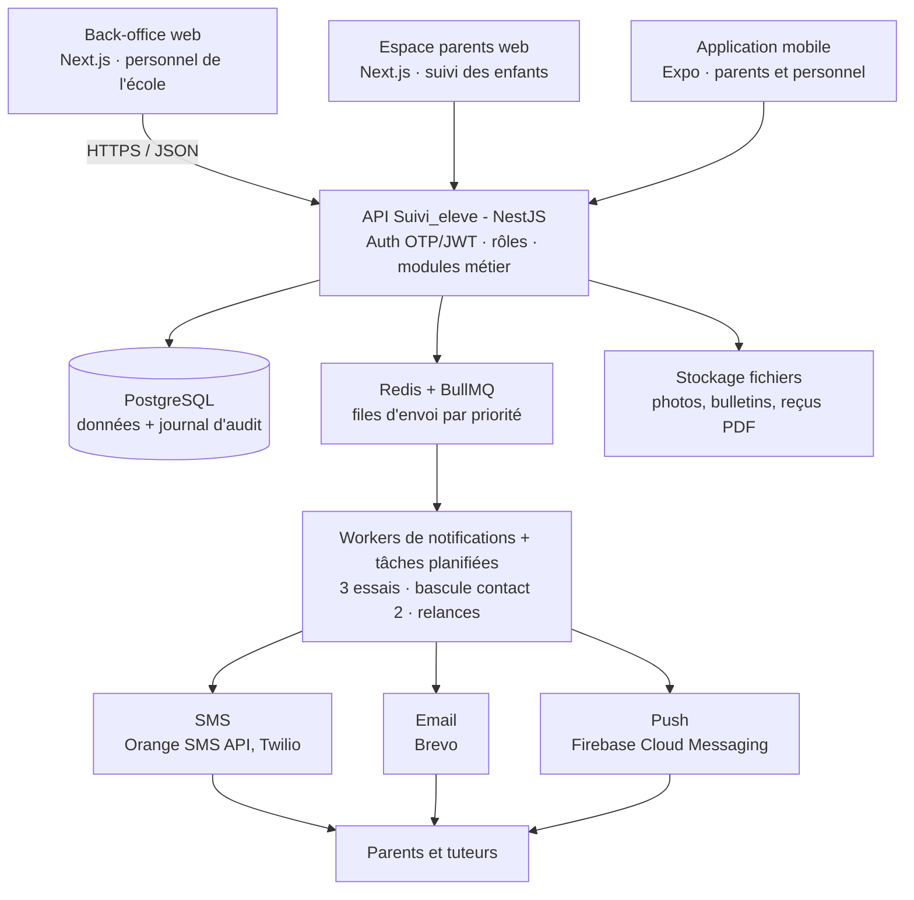

# Cahier des charges — Suivi_eleve

Version 1.0 · 5 octobre 2026

---

## 1. Présentation du projet

Suivi_eleve est une application web et mobile qui informe les parents en temps réel, par SMS, email et notification push, de tout ce qui concerne la scolarité de leur enfant.

**Contexte.** Aujourd'hui, les parents apprennent souvent trop tard qu'un cours a été annulé, que les élèves ont été libérés plus tôt, qu'un paiement est en retard ou qu'un incident a eu lieu. Les appareils des élèves (téléphones, tablettes, ordinateurs) sont aussi régulièrement perdus, confondus ou utilisés en classe sans contrôle.

**Objectifs.**

1. Centraliser le dossier de chaque élève et de ses tuteurs.
2. Enregistrer les appareils de chaque élève pour les identifier, les restituer et encadrer leur usage en classe.
3. Prévenir les parents en moins de 5 minutes de tout événement qui les concerne : absence de cours, libération anticipée, résultats, comportement, paiements, événements de l'école.
4. Donner aux parents un espace web et mobile pour consulter l'historique, les résultats et la situation financière.

**Périmètre de la version 1.** Une seule école, plusieurs classes, une année scolaire active à la fois. Hors périmètre : emploi du temps complet, cours en ligne, messagerie libre entre parents.

**Glossaire.** *Tuteur* : parent ou responsable légal de l'élève. *Notification* : message envoyé par SMS, email ou push. *Libération anticipée* : sortie des élèves avant l'heure prévue.

## 2. Acteurs et rôles

Six rôles se partagent l'application ; chaque utilisateur n'accède qu'aux données de son rôle et, pour un parent, à celles de ses propres enfants.

| Rôle | Support principal | Peut faire |
| --- | --- | --- |
| Administrateur (direction) | Web | Gérer les utilisateurs, classes, années scolaires, paramètres SMS/email ; tout consulter ; publier tout type d'annonce |
| Secrétariat / Vie scolaire | Web | Inscrire les élèves et tuteurs, enregistrer les appareils, déclarer absence de cours et libération anticipée, publier les événements |
| Enseignant | Web et mobile | Saisir notes et appréciations, signaler un comportement marquant, signaler un appareil utilisé en classe |
| Surveillant | Mobile | Rechercher un appareil (numéro de série, IMEI, description), déclarer un appareil trouvé, confisqué ou restitué |
| Comptable | Web | Définir les frais mensuels, enregistrer les paiements, suivre les retards, déclencher les relances |
| Parent / Tuteur | Mobile et web | Consulter le dossier de ses enfants, recevoir et relire les notifications, choisir ses canaux, accuser réception |

L'élève n'a pas de compte en version 1 ; un accès élève en lecture seule est envisageable en version 2.

## 3. Exigences fonctionnelles

Le système couvre huit modules ; chaque exigence porte un identifiant (EF-xx) réutilisé dans les tests de recette.

### 3.1 Gestion des élèves

- **EF-01** Enregistrer un élève avec : Identifiant (matricule unique généré automatiquement, ex. `SE-2026-0001`), Prénoms, Nom, Genre, Date de naissance (l'âge est calculé, pas saisi), Classe, Téléphone de l'élève (facultatif), Tuteur, Contact_tuteur_1 (obligatoire), Contact_tuteur_2 (facultatif), Email du tuteur, Photo (facultative).
- **EF-02** Rattacher un ou plusieurs tuteurs à un élève, et plusieurs élèves (frères et sœurs) au même tuteur.
- **EF-03** Modifier, archiver (jamais supprimer définitivement) et changer de classe un élève, avec historique.
- **EF-04** Rechercher et filtrer par nom, matricule, classe, tuteur ; importer et exporter la liste (Excel/CSV).
- **EF-05** Contrôler les numéros au format international (ex. `+221 77 123 45 67`) et refuser les doublons de matricule.

### 3.2 Gestion des appareils

- **EF-10** Enregistrer pour chaque élève ses appareils : type (téléphone, tablette, ordinateur), marque, modèle, couleur, numéro de série, IMEI (téléphones), signes distinctifs, photo.
- **EF-11** Générer une étiquette QR code par appareil ; le scan affiche le propriétaire au personnel autorisé uniquement.
- **EF-12** Rechercher un appareil par IMEI, numéro de série, QR code ou description pour retrouver son propriétaire.
- **EF-13** Gérer le statut : actif, déclaré perdu, trouvé, confisqué, restitué ; chaque changement est horodaté avec son auteur.
- **EF-14** Enregistrer un usage non autorisé en classe (élève, appareil, enseignant, heure) et prévenir le parent ; au-delà d'un seuil paramétrable (ex. 3 par mois), créer automatiquement un comportement marquant.
- **EF-15** Permettre au parent de déclarer un appareil perdu depuis l'application.

### 3.3 Absence de cours

- **EF-20** Déclarer qu'il n'y a pas cours : pour toute l'école, une ou plusieurs classes, ou un cours précis ; date, créneau, motif.
- **EF-21** Envoyer immédiatement la notification aux tuteurs concernés, ou la programmer (ex. la veille à 18 h).

### 3.4 Libération anticipée

- **EF-30** Déclarer une libération non prévue : classes concernées, heure de sortie, motif obligatoire (grève, coupure d'électricité, intempéries, absence d'enseignant, autre).
- **EF-31** Notification prioritaire : envoi SMS et push en moins de 2 minutes, email en parallèle.
- **EF-32** Le parent peut accuser réception ; l'école voit qui a lu et qui n'a pas lu.

### 3.5 Résultats et admission

- **EF-40** Chaque professeur saisit, pour sa matière et sa classe, la moyenne de chaque élève par période (sur 20) et une appréciation. Les professeurs de chaque matière sont désignés par la direction (révisé le 05/10/2026 : aucune note de devoir n'est saisie).
- **EF-41** Le professeur principal (ou la direction) saisit la moyenne générale, le rang et l'appréciation générale. L'application ne calcule aucune moyenne ni aucun rang ; elle génère le bulletin PDF à partir des saisies.
- **EF-42** Publier les résultats après validation de la direction ; notifier les parents (moyenne et lien vers le bulletin, jamais le détail par SMS).
- **EF-43** Enregistrer la décision de fin d'année (admis, redouble, exclu, orienté) et la notifier.

### 3.6 Comportements marquants

- **EF-50** Signaler un comportement positif (félicitations, encouragement) ou négatif (retard, absence, indiscipline, fraude, violence) avec gravité, description et sanction éventuelle.
- **EF-51** Les cas graves sont validés par la direction avant envoi ; les autres partent directement.
- **EF-52** Historique consultable par le parent ; convocation possible avec date de rendez-vous.

### 3.7 Paiements mensuels

- **EF-60** Définir les frais par classe : inscription, mensualité, échéance (ex. le 5 du mois), réductions (fratrie, bourse).
- **EF-61** Enregistrer un paiement (montant, mode : espèces, Mobile Money, virement ; référence) et envoyer un reçu au parent.
- **EF-62** Détecter automatiquement les retards chaque jour et envoyer les relances : rappel 3 jours avant l'échéance, relance J+1, J+7, J+15 (paramétrable).
- **EF-63** Tableau de bord : encaissé, attendu, impayés par classe et par mois ; export comptable.
- **EF-64** (Version 2) Paiement en ligne par Mobile Money (Wave, Orange Money) ou carte.

### 3.8 Événements de l'école

- **EF-70** Publier un événement : titre, description, date et heure, lieu, public (toute l'école ou classes), modalités d'organisation, pièce jointe.
- **EF-71** Calendrier des événements dans l'application ; rappel automatique la veille.
- **EF-72** Demande de participation ou d'autorisation parentale avec réponse oui/non.

### 3.8 bis Absences des élèves (ajout du 05/10/2026)

- **EF-75** Faire l'appel d'une classe : date, créneau (ex. 08h-10h), matière, élèves absents cochés. Réservé aux enseignants, à la vie scolaire et à la direction.
- **EF-76** Une absence non justifiée prévient aussitôt les tuteurs (SMS, email, application), sans possibilité de désactiver ce message. Une absence déjà connue de l'école peut être notée « justifiée » : aucun message n'est alors envoyé.
- **EF-77** Une même absence (élève, date, créneau) n'est jamais notée ni signalée deux fois.
- **EF-78** Le parent consulte les absences de ses enfants et transmet un motif ; la vie scolaire justifie l'absence ou la supprime si elle a été saisie par erreur.

### 3.9 Moteur de notifications (commun)

- **EF-80** Chaque notification part sur les canaux choisis : SMS, email, push. Le SMS est court (160 caractères) ; l'email et l'application portent le détail.
- **EF-81** Modèles de messages modifiables par type, avec variables (`{prenom_eleve}`, `{classe}`, `{heure}`, `{motif}`, `{montant}`).
- **EF-82** Envoi à Contact_tuteur_1 et Contact_tuteur_2 ; si un SMS échoue, nouvel essai puis bascule sur l'autre contact.
- **EF-83** Journal de chaque envoi : destinataire, canal, statut (en file, envoyé, délivré, échoué, lu), coût SMS.
- **EF-84** Le parent règle ses préférences par type, sauf les messages obligatoires (libération anticipée, absence de cours) qui partent toujours.
- **EF-85** Langue du message selon le profil du tuteur (français en version 1, wolof ou anglais en option).

| Type de notification | SMS | Email | Push | Priorité | Obligatoire |
| --- | --- | --- | --- | --- | --- |
| Libération anticipée | Oui | Oui | Oui | Urgente | Oui |
| Pas de cours | Oui | Oui | Oui | Haute | Oui |
| Absence injustifiée de l'élève | Oui | Oui | Oui | Haute | Oui |
| Comportement marquant | Oui | Oui | Oui | Haute | Oui |
| Retard de paiement | Oui | Oui | Oui | Normale | Oui |
| Résultats et admission | Oui (résumé) | Oui (bulletin) | Oui | Normale | Non |
| Reçu de paiement | Non | Oui | Oui | Basse | Non |
| Événement de l'école | Oui | Oui | Oui | Normale | Non |
| Usage d'appareil en classe | Non | Oui | Oui | Normale | Non |

## 4. Modèle de données

Quinze entités suffisent à la version 1 ; l'élève est au centre, relié à ses tuteurs, sa classe, ses appareils, ses notes, ses comportements et ses paiements.

| Entité | Attributs principaux | Relations |
| --- | --- | --- |
| Eleve | id, matricule, prenoms, nom, genre, date_naissance, telephone, photo_url, statut (actif/archivé), date_inscription | 1 classe ; N tuteurs ; N appareils |
| Tuteur | id, prenoms, nom, lien (père, mère, autre), contact_1, contact_2, email, langue, compte_utilisateur_id | N élèves (table EleveTuteur) |
| EleveTuteur | eleve_id, tuteur_id, principal (oui/non) | liaison |
| Classe | id, nom (ex. 6e A), niveau, annee_scolaire_id, enseignant_principal_id | N élèves |
| AnneeScolaire | id, libelle (2026-2027), date_debut, date_fin, active | N classes, N périodes |
| Appareil | id, eleve_id, type, marque, modele, couleur, numero_serie, imei, signes_distinctifs, photo_url, qr_code, statut | 1 élève ; N incidents |
| IncidentAppareil | id, appareil_id, type (perdu, trouvé, confisqué, restitué, usage en classe), date_heure, lieu, auteur_id, commentaire | 1 appareil |
| Matiere / Enseignement | matiere : nom, coefficient (affiché sur le bulletin) ; enseignement : classe_id, matiere_id, enseignant_id | qui saisit quelle moyenne |
| MoyenneMatiere | eleve_id, periode_id, matiere_id, moyenne (saisie), appreciation, saisie_par | N par élève et période |
| Resultat | eleve_id, periode, moyenne, rang, decision, bulletin_url, publie | 1 élève |
| Comportement | id, eleve_id, type (positif/négatif), categorie, gravite, description, sanction, auteur_id, valide_par, date | 1 élève |
| Frais / Echeance | frais : classe_id, type, montant ; echeance : eleve_id, mois, montant_du, date_limite, statut (payé, partiel, en retard) | 1 élève |
| Paiement | id, echeance_id, montant, mode, reference, date, recu_par, recu_url | 1 échéance |
| Annonce | id, type (pas de cours, libération, événement), titre, message, motif, date_debut, date_fin, cible (école/classes), auteur_id | N classes ciblées |
| Notification | id, type, tuteur_id, eleve_id, canal, contenu, statut, envoye_le, lu_le, cout, reference_fournisseur | 1 tuteur |
| Absence | id, eleve_id, date, creneau, matiere, justifiee, motif, justification_parent, signale_par, justifiee_par | 1 élève |
| Utilisateur | id, nom, email, telephone, role, mot_de_passe_hash, actif, derniere_connexion | 1 rôle |

Toutes les tables portent `cree_le`, `modifie_le` et `cree_par` ; un journal d'audit trace chaque modification sensible.

## 5. Exigences non fonctionnelles

Les données concernent des mineurs : la sécurité et la confidentialité priment sur toute autre exigence.

| Domaine | Exigence mesurable |
| --- | --- |
| Confidentialité | Consentement du tuteur à l'inscription ; un parent ne voit que ses enfants ; conformité à la loi locale sur les données personnelles (au Sénégal : loi 2008-12 et déclaration à la CDP) ; droit d'accès, de rectification et d'effacement |
| Sécurité | HTTPS partout ; mots de passe hachés (bcrypt/argon2) ; connexion parent par numéro + code OTP SMS ; jetons JWT courts avec rafraîchissement ; contrôle d'accès par rôle côté serveur ; journal d'audit |
| Performance | Page ou écran chargé en moins de 2 s en 3G ; 1 000 SMS envoyés en moins de 5 min via une file d'attente |
| Disponibilité | 99,5 % sur l'année scolaire ; sauvegarde quotidienne chiffrée conservée 30 jours ; restauration testée chaque trimestre |
| Fiabilité des envois | Nouvel essai automatique (3 fois) ; bascule SMS vers un second fournisseur en cas de panne ; aucun message perdu |
| Mobilité | Application Android 8+ et iOS 14+ ; consultation hors ligne des dernières notifications |
| Ergonomie | Interface en français, simple pour des parents peu à l'aise avec le numérique ; gros boutons ; icônes par type de message |
| Coûts | Compteur de SMS consommés par mois ; plafond paramétrable ; push et email privilégiés quand le parent a l'application |
| Évolutivité | Architecture prête pour plusieurs écoles (champ `ecole_id`) sans réécriture |
| Maintenabilité | Code versionné (Git), tests automatisés sur les règles métier, documentation de l'API (OpenAPI) |

## 6. Architecture technique

Une API unique sert le back-office web, l'espace parents et l'application mobile ; tous les SMS, emails et push passent par une file d'attente pour ne jamais bloquer l'interface ni perdre un message.

L'API dépose chaque envoi dans Redis ; les workers le délivrent par le bon canal, réessaient en cas d'échec et enregistrent le statut.

| Composant | Choix proposé | Raison |
| --- | --- | --- |
| Backend / API | NestJS (TypeScript) + Prisma | Modules clairs, typage, documentation OpenAPI automatique |
| Base de données | PostgreSQL | Relations nombreuses, fiable, gratuit |
| Files et tâches planifiées | Redis + BullMQ | Priorités, nouveaux essais, relances quotidiennes |
| Web (admin + parents) | Next.js + Tailwind | Un seul code pour les deux espaces, rapide en 3G |
| Mobile | React Native (Expo) | Android et iOS avec un seul code, même langage que le web |
| SMS | Orange SMS API (principal), Twilio ou Africa's Talking (secours) | Couverture locale et bascule en cas de panne |
| Email | Brevo (ou SendGrid) | Offre gratuite suffisante au démarrage, suivi d'ouverture |
| Push | Firebase Cloud Messaging | Gratuit, Android et iOS |
| Fichiers | Stockage compatible S3 (ex. Cloudflare R2, MinIO) | Photos, bulletins et reçus PDF |
| Hébergement | VPS avec Docker (ex. 4 Go RAM) + sauvegarde externe | Coût maîtrisé, suffisant pour une école |

Alternative si l'équipe connaît PHP : Laravel + MySQL pour l'API et le web, Flutter pour le mobile ; le cahier des charges reste identique.

## 7. Livrables, planning et critères d'acceptation

Le projet se livre en cinq lots sur environ 16 semaines ; chaque lot est utilisable seul et validé par une recette avant le suivant.

| Lot | Contenu | Durée estimée | Livrable |
| --- | --- | --- | --- |
| 0. Cadrage | Validation du cahier des charges, maquettes des écrans, choix des fournisseurs SMS/email | 2 semaines | Maquettes validées, comptes fournisseurs |
| 1. Socle | Authentification, rôles, élèves, tuteurs, classes, import Excel | 3 semaines | Back-office web utilisable |
| 2. Appareils + notifications | Appareils, QR codes, moteur de notifications, absence de cours, libération anticipée | 4 semaines | Premiers SMS/emails réels aux parents pilotes |
| 3. Scolarité + finances | Notes, bulletins, décisions, comportements, frais, paiements, relances | 4 semaines | Bulletins PDF, tableau de bord financier |
| 4. Mobile + mise en production | Application parents (Android/iOS), push, événements, pilote sur 2 classes puis toute l'école | 3 semaines | Applications publiées, formation du personnel |

**Livrables documentaires** : code source, documentation de l'API, guide administrateur, guide parent (1 page illustrée), procédure de sauvegarde et restauration.

**Critères d'acceptation de la version 1**

- [ ] Un élève et ses deux contacts tuteurs s'enregistrent en moins de 2 minutes.
- [ ] Un appareil trouvé est rattaché à son propriétaire en moins de 30 secondes (scan QR ou recherche IMEI).
- [ ] Une libération anticipée déclarée pour 3 classes produit un SMS chez 100 % des tuteurs joignables en moins de 2 minutes.
- [ ] Un paiement en retard déclenche la relance J+1 sans action humaine.
- [ ] Un parent ne peut voir aucune donnée d'un élève qui n'est pas le sien (test d'intrusion réussi).
- [ ] Chaque notification envoyée apparaît dans le journal avec son statut de délivrance.
- [ ] Les bulletins publiés sont téléchargeables depuis l'application mobile.

**Questions ouvertes** : nombre d'élèves et de classes ; budget SMS mensuel ; pays et fournisseur SMS ; système de notation (sur 10 ou sur 20) ; trimestres ou semestres.

## 8. Prompts de développement

Les prompts pour construire le projet étape par étape avec un assistant IA sont dans [PROMPTS.md](PROMPTS.md).
